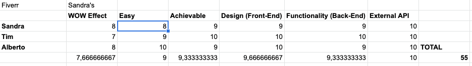

# DEVERR 👨🏼‍💻
by [Alberto Cerrone](www.linkedin.com/in/alberto-cerrone), [Sandra Spighel](https://www.linkedin.com/in/sandraspighel/) && [Tim Frame](https://www.linkedin.com/in/tim-frame-187241100/) AKA SpicyKiwiPizza 🌶🥝🍕<br>


<br>
Timeline: 10 days

👉 [<b>Try Me</b>](https://deverr.herokuapp.com/) 👈

---

## Overview
<br>

Deverr allows developers to connect with companies or people advertsing jobs.
Inspired by the Fiverr website, the platform is based on a bidding system where Auctioneers post Jobs and interested developers(Bidders) can ‘bid’ to win the contract.

This project has been developed during General Assembly course, with the goal of design a full-stack MERN app using over 10 day time. I'm actively working on this project.

---

### Table of Contents

- [Get Started](#get-started)
  - [Required](#required)
  - [Installation Steps](#installation-steps)
  - [How To Use It](#how-to-use-it)
- [How We Made It](#how-we-made-it)
  - [Technologies Used](#technologies-used)
  - [Approach Taken](#approach-taken)
  - [Bugs, Blockers & Wins](#bugs,-blockers-&-wins)
    - [Bugs](#bugs)
    - [Challenges & Wins](#challenges-&-wins)
  - [Future Features & Key Learning](#future-features-&-key-learning)
    - [Future Features](#future-features)
    - [Key Learning](#key-learning)
- [Contributors](#contributors)
  - [Contributing to this project](#contributing-to-this-project) 
- [License & Copyright](#license-&-copyright)
- [Author Info](#author-info)

---

## Get Started
### Required

If you would like to participate in this project, you can download this JSON with all the routes to test the responses from the API. <br>
This JSON has to be imported to [Insomnia](https://insomnia.rest/)👇<br>

<a download href="https://raw.githubusercontent.com/albertocerrone/Deverr/main/assets/readme/insomnia-Deverr.json"></a>
<br>


### Installation Steps
Clone or download the repository then do the following in Terminal:

- If your mongoDB is offline, turn it on:  `mongod --dbpath ~/data/db`
- Install back-end dependencies:  `yarn`
- Change into front-end directory: `cd client`
- Install front-end dependencies: `yarn`
- Change into back-end directory: `..`
- Start back-end and front-end together: `yarn dev-fullstack`
OR:
  - Start back-end server: `yarn dev`
  - Start front-end server: `cd client && yarn start`
- If you need to seed your database: `yarn seed`
### How to Use It


<br>
The landing page of Deverr allows the user to choose four options from the navbar:
- Job, to check all the jobs currently on the website
- People, to review all the current users of the site
- Register, if they don't have an account
- Login, to access the website

#### Register
<br>
If the user decide to create an account they are taken to the register page. The first step is to select if they are a, ‘Bidder’ or an ‘Auctioneer. 
- <br>
If a user chooses the ‘Bidder’, option they are required to provide name, email, password, password confirmation, bio, city, skills(can choose multiple), select there availability and choose a profile image.
- <br>
If a user chooses the ‘Auctioneer’ option they are required to provide a name, username, password, password confirmation, bio, city, confirm they are an auctioneer and a profile photo.

If the user registration is successful they are conducted to the login page, otherwise, they will receive an error message underneath the incorrect form field

#### Login
<br>
On the login page, the user needs to provide the email and password they provided during the registration process. If either field is incorrect on submission the user will receive an error message.

##### My Profile
<br>

Once logged in the user is directed to the profile page. Here they can see all the details they provided during registration. Also, they have the option to edit or delete their profile.<br>
If the user is an auctioneer, they have one more button that allows them to create a new job.

<br>
If the auctioneer chooses to create a new job they are moved to a new page. Here they can provide all the details needed.<br>
Once the job is submitted the user is taken to the live view of the job.

#### Jobs
<br>

If the user navigates to the "Job" page, they will have a full view of all the live jobs and the opportunity to filter them by category using the carousel at the top of the page.<br>
When they click on a job card they will move to the page of that job.

##### Job Page
<br>
Here a "Bidder" can comment on a job to ask for more details or place a bid using the "Place Bid" field where the bidder needs to provide a short message and how much they would like to bid. <br>
Once a "Bidder" has placed a bid they will get an alert to say their bid has been placed. The bid itself is only visible to the "Auctioneer" who created the job.
<br>
On the other side, the "Auctioneer" has a slightly different view of this page.
He can delete or edit the job, and once the job starts to receive bids, the "Auctioneer" can see all the bids and by clicking "Accept This Bids" will choose the winning bid.
<br>
Once the bid has been accepted, all the "Accept This Bids" button is removed from all the remaining bids and a message is sent to the bidder profile with the winning bid.

[Back To The Top](#deverr-)

---
## How We Made It
### Technologies Used

#### Languages Used
- [JavaScript](https://www.javascript.com/)
- [Node.js](https://nodejs.org/)
#### Frameworks
- [React with React Hooks](https://reactjs.org/)
- [SASS](https://sass-lang.com/)
- [Express](https://expressjs.com/)
- [MongoDB](https://www.mongodb.com/3)
#### Dependencies
##### Backend
- [BCrypt](https://pypi.org/project/bcrypt/)
- [Concurrently](https://github.com/kimmobrunfeldt/concurrently)
- [Faker.js](https://github.com/Marak/Faker.js)
- [Node-JsonWebToken](https://github.com/auth0/node-jsonwebtoken)
- [Nodemon](https://github.com/remy/nodemon)
- [Mongoose](https://mongoosejs.com/)
- [Mongoose-unique-validator](https://mongoosejs.com/docs/validation.html)

##### Frontend
- [Axios](https://github.com/axios/axios)
- [React-Icons](https://react-icons.github.io/react-icons/)
- [React-Slick](https://react-slick.neostack.com/)
- [React-router-dom](https://reactrouter.com/web/guides/quick-start)
- [Styled-Components](https://styled-components.com/)
- [http-proxy-middleware](https://github.com/chimurai/http-proxy-middleware)

##### API
- [Cloudinary](https://cloudinary.com/documentation)

### Approach Taken
For this project, we wanted to create something that could give us a good challenge, not only to cement our knowledge learned during lessons but to let us face problems that we never handled before.

We agreed since the beginning to split ownership of different areas: I was responsible for styling, Sandra was responsible for the back-end and Tim was responsible for the front-end.<br>
Even if the roles were split, we spent all our coding time in contact through Zoom because everyone had to participate in helping others. Thanks to this, everyone had the opportunity to get the hands dirty with every bit of the project.


##### Planning
The idea of Deverr was born thanks to a process that I created while managing teams in my previous industry.<br>
Every one of us had 45 minutes to find a proposal idea:
- Sandra proposed for a Fiverr clone;
- Tim proposed an Airbnb for camping;
- I proposed a mixed clone between Netflix and Plex.
<br>

At the end of each presentation, we had to give a vote from 1 to 10 to each project following these steps:
- Wow Effect, does it sounds cool?
- Easy, does it seem easy to produce?
- Achievable, can we built it in the short time that we have?
- Design, does the design looks nice? Is it difficult to make?
- Functionality, can we build the back-end without any problems?
- External API, do we need to use external APIs? Are they difficult to use?

The project with the highest points was the one we were going to build.

This process not only allowed us to give a numeric value to our feelings, allowing us a more democratic decision, but let us find the weakest point of each project and come out with a better solution. <br>
This is why we went for a Fiverr clone, with a bidding system (the weakest point was the WOW Effect, and we thought that this could improve that score)

After we were happy about the project we throw down a small wireframe to understand better what was the flow of the website. 


We decided to have 6 categories of job:
- Android Developer
- Apple Developer
- Back-end Developer
- Front-end Developer
- Game Developer
- UI Developer

When we felt ready to start, we began to work together on the back-end:
Tim started to take care of installing dependencies and creating job's seeds, Sandra was coding all the User and Job models and I found Faker.js that allowed us to create dummy data for our users in a much more simple way.<br>

We checked that all the models and controllers worked with Insomnia and when we were happy about it, I and Tim moved to work on the client-side and each one of us continued to work on different tasks.

I went for a glass morph design, trying to give a sharp and captivating look.
I wanted to experiment more with SASS and discover more features.

I tried to keep a well-organized file organization with a file `_variables.scss` that stores all the common variables shared between different components.
```scss
$gm-background-1: linear-gradient(130deg, rgba(242,242,249,0.8) 0%, rgba(253,254,254,0.2) 100%);
$gm-background-2: rgba(255, 255, 255, 0.81);
$gm-background-3: rgba( 255, 255, 255, 0.15 );
$gm-blur: blur( 4px );
$gm-border-radius: 15px;
$gm-border: 1px solid rgba(255, 255, 255, 0.555);
$gm-shadow: 4px 8px 10px 0 rgba(3, 5, 39, 0.55);
$gm-shadow-sm: 2px 4px 7px 0 rgba(2, 5, 39, 0.57);
//Logo
$deverr-color: -webkit-linear-gradient(90deg, rgba(38, 3, 163, 0.637) 0%, rgba(11, 183, 206, 0.623) 100%);

//Basic Font Color
$font-basic: rgb(101, 100, 105);
$font-blue: rgb(10, 66, 187);
```

All the buttons are managed using `@mixin`; this allowed me to easily create different buttons, with different sizes.

```scss
@mixin normalButton($color_1, $color_2, $size: 0.7rem) {
  margin: 0 2px 5px;
  border-radius: 15px;
  padding: 8px 30px;
	box-shadow: 1px 1px 3px -1px #121312c7, -1px -1px 2px -1px #ffffff77;
  font-size: $size;
  font-weight: 600;
  text-transform: uppercase ;
  color: $color_2;
  text-shadow: none;
  background: $color_1;
	transition: $transition;
	&:hover {
    color: adjust-color($color_2, $lightness: 20%) ; 
    box-shadow: 3px 3px 5px -1px #121312c7, -2px -2px 4px -1px #ffffff77;
	}
	&:active:focus {
		border:none;
    box-shadow: inset 2px 2px 5px -1px #1111118f, inset -3px -3px 9px -2px #ffffff54;
    color: darken($color: $color_2, $amount: 10);
    font-size: calc(#{$size} - 10%)
  }
}


// Normal Buttons
.btn {
  @include normalButton($white-shaded, $standard);
}
.btn-xs {
  @include normalButton($white-shaded, $standard, $xs);
}
.btn-sm {
  @include normalButton($white-shaded, $standard, $sm);
}
.btn-lg {
  @include normalButton($white-shaded, $standard, $lg);
}
.btn-xl {
  @include normalButton($white-shaded, $standard, $xl);
}
// Secondary Buttons
.btn-secondary  {
  @include normalButton($secondary, $white);
}
.btn-secondary-xs {
  @include normalButton($secondary, $white, $xs);
}
.btn-secondary-sm {
  @include normalButton($secondary, $white, $sm);
}
.btn-secondary-lg {
  @include normalButton($secondary, $white, $lg);
}
.btn-secondary-xl {
  @include normalButton($secondary, $white, $xl);
}
// Green Buttons
.btn-submit {
  @include normalButton($submit, $white);
} 
.btn-submit-xs {
  @include normalButton($submit, $white, $xs);
} 
.btn-submit-sm {
  @include normalButton($submit, $white, $sm);
} 
.btn-submit-lg {
  @include normalButton($submit, $white, $lg);
} 
.btn-submit-xl {
  @include normalButton($submit, $white, $xl);
} 
// Red Buttons
.btn-cancel {
  @include normalButton($cancel, $white);
}
.btn-cancel-xs {
  @include normalButton($cancel, $white, $xs);
}
.btn-cancel-sm {
  @include normalButton($cancel, $white, $sm);
}
.btn-cancel-lg {
  @include normalButton($cancel, $white, $lg);
}
.btn-cancel-xl {
  @include normalButton($cancel, $white, $xl);
}

```

As well I wanted to look at how styled-components works and I created a small button that changes color and icon based on the prop that is given when used.
```js
import React from 'react'
import styled from 'styled-components'

import { RiCheckLine, RiCloseLine } from 'react-icons/ri'

const Button = styled.div`
  width: 25px;
  height: 25px;
  border-radius: 30px;
  background: ${props => props.color || 'rgb(8, 99, 8)'};
  
`

function RoundedButtons({ type = 'green' }) {
  return (
    <Button color={type}>
      {type === 'green' ? <RiCheckLine /> : <RiCloseLine />}
    </Button>
  )
}

export default RoundedButtons
```

<br>

[Back To The Top](#deverr-)

---
### Bugs, Blockers & Wins

#### Bugs
- [ ] Fix problems with responsiveness
- [ ] Fix UI in the Job page
- [ ] Fix UI in People Page
- [ ] Improve the UI 
- [x] Improve image rendering  
#### Challenges & Wins
This has been the first project I built in a team, using Git and Github. <br>
Quickly I got used to creating branches and work in safe environments and I loved it. <br>

We created always the opportunity to learn and ask for help from each other and that allowed us not only to produce a website packed with features, but to be all of us, the owners of each line of code.<br>

As well this has been the first time working on top of a code wrote by someone else. Coming from the same course and mentor has been simple to do so but sometimes I needed some clarification and Sandra and Tim were always available.

One of our biggest challenges has been producing a website that had more than one type of user. We didn't think about it while planning, but having the two users slowed us down a bit.<br>
Another little challenge that I had, is to always be mainly focused on be styling and after a few days, monotony started to chick in.<br>

Overall I really enjoyed working on this project and working in well organized team.

#### Updates

I've improved the overall performance of the Job Index page reducing from 7147ms to 3538ms using containment and content-visibility


[Back To The Top](#deverr-)

---
### Future Features & Key Learning

#### Future Features
- [ ] Improve Notification feature
- [ ] Improve Messaging feature

#### Key Learning
This project told me a lot, especially about teamwork while coding:
- Having a clean, understandable code makes everything more fun and easy to maintain. 
- It's imperative, especially in a team, to have the final goal clear and described in detail from the beginning to make sure that every person on the team aims towards the same target.
- Daily stand-ups and de-briefing are very powerful.

UI-wise, I found it difficult to build this project without a mock-up made with Figma or Adobe XD. <br>
For the next projects, I would prefer to plan the UI before starting to code it.

[Back To The Top](#deverr-)

---
## Contributors
* Alberto Cerrone [📧](mailto:cerrone.alberto93@gmail.com)
* Sandra Spighel [📧](mailto:s.spighel@gmail.com)
* Tim Frame [📧](mailto:t.f.retouching@gmail.com)

### Contributing to this project
If you have suggestions for improving this project, please [open an issue on GitHub](https://github.com/albertocerrone/Deverr/issues/new).

[Back To The Top](#deverr-)

---
## License & copyright

This work is dedicated to the [public domain (CC0 1.0)](http://creativecommons.org/publicdomain/zero/1.0/). To the extent possible under law, Alberto Cerrone has waived all copyright and related or neighbouring rights to Deverr. See the LICENSE file for all the legalese.


[Back To The Top](#deverr-)

---
## Author Info
- Twitter - [@AlbertoCerrone](https://twitter.com/AlbertoCerrone)
- LinkedIn - [Alberto Cerrone](http://www.linkedin.com/in/alberto-cerrone/)
- Website - [Portfolio](http://albertocerrone.co.uk)

[Back To The Top](#deverr-)

